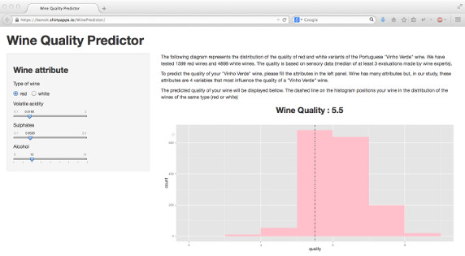

## Wine Predictor
##### Online tool for predicting the quality of your "Vinho Verde" wine
###### Photo by Tobias Andersson Åkerblom


---

## How to use the Wine Predictor ?

1. Go to https://benoit.shinyapps.io/WinePredictor/
2. Fill the attributes in the left panel
3. See the predicted quality of your wine and position your wine in the distribution of the wines of the same type (red or white).



---

## How it works ? Prediction of the quality #1

We obtained two datasets, related to red and white variants of the Portuguese "Vinho Verde" wine, from [UCI Machine Learning Repository](https://archive.ics.uci.edu/ml/datasets/Wine+Quality) website.
```{r}
red.wines     <- read.csv("winequality-red.csv", sep=";")
str(red.wines)
```

---

## How it works ? Prediction of the quality #2

We selected 3 variables (sulphates, alcohol and volatile.acidity) as part of the "best regressors" using ANOVA method
```{r}
anova(lm(quality~., red.wines))
```

---

## How it works ? Prediction of the quality #3

Based on those 2 models (red and white), we predict the quality of the wine when an input variable changes on the website:
```{r}
# Simulated input data from the GUI
input <- data.frame(acidity=0.5168, sulphates=0.6528, alcohol=10)
```
```{r, tidy=FALSE}
# The model
fit     <- lm(quality~sulphates+alcohol+volatile.acidity, red.wines)
# The predicted quality
quality <- round(predict(fit, data.frame(volatile.acidity=input$acidity, 
                                         sulphates=input$sulphates, 
                                         alcohol=input$alcohol))
                 ,1)
quality[[1]]
```