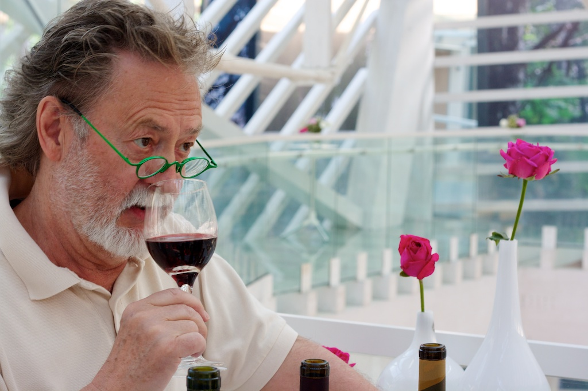
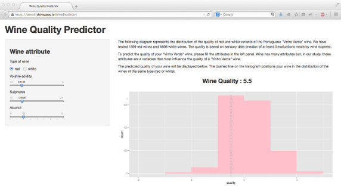

## Wine Predictor
##### Online tool for predicting the quality of your "Vinho Verde" wine
###### Photo by Tobias Andersson Åkerblom


---

## How it works ?

1. Go to https://benoit.shinyapps.io/WinePredictor/
2. Fill the attributes in the left panel
3. See the expected quality of your wine and positions your wine in the distribution of the wines of the same type (red or white).



---

## Prediction of the quality #1

We obtained two datasets, related to red and white variants of the Portuguese "Vinho Verde" wine, from [UCI Machine Learning Repository](https://archive.ics.uci.edu/ml/datasets/Wine+Quality) website.

```r
red.wines <- read.csv("winequality-red.csv", sep = ";")
str(red.wines)
```

```
## 'data.frame':	1599 obs. of  12 variables:
##  $ fixed.acidity       : num  7.4 7.8 7.8 11.2 7.4 7.4 7.9 7.3 7.8 7.5 ...
##  $ volatile.acidity    : num  0.7 0.88 0.76 0.28 0.7 0.66 0.6 0.65 0.58 0.5 ...
##  $ citric.acid         : num  0 0 0.04 0.56 0 0 0.06 0 0.02 0.36 ...
##  $ residual.sugar      : num  1.9 2.6 2.3 1.9 1.9 1.8 1.6 1.2 2 6.1 ...
##  $ chlorides           : num  0.076 0.098 0.092 0.075 0.076 0.075 0.069 0.065 0.073 0.071 ...
##  $ free.sulfur.dioxide : num  11 25 15 17 11 13 15 15 9 17 ...
##  $ total.sulfur.dioxide: num  34 67 54 60 34 40 59 21 18 102 ...
##  $ density             : num  0.998 0.997 0.997 0.998 0.998 ...
##  $ pH                  : num  3.51 3.2 3.26 3.16 3.51 3.51 3.3 3.39 3.36 3.35 ...
##  $ sulphates           : num  0.56 0.68 0.65 0.58 0.56 0.56 0.46 0.47 0.57 0.8 ...
##  $ alcohol             : num  9.4 9.8 9.8 9.8 9.4 9.4 9.4 10 9.5 10.5 ...
##  $ quality             : int  5 5 5 6 5 5 5 7 7 5 ...
```


---

## Prediction of the quality #2

We selected 3 variables (sulphates, alcohol and volatile.acidity) as part of the "best regressors" using ANOVA method

```r
anova(lm(quality ~ ., red.wines))
```

```
## Analysis of Variance Table
## 
## Response: quality
##                        Df Sum Sq Mean Sq F value  Pr(>F)    
## fixed.acidity           1     16    16.0   38.19 8.1e-10 ***
## volatile.acidity        1    144   143.6  341.91 < 2e-16 ***
## citric.acid             1      0     0.0    0.06  0.8095    
## residual.sugar          1      0     0.2    0.38  0.5396    
## chlorides               1     13    13.1   31.11 2.9e-08 ***
## free.sulfur.dioxide     1      3     3.0    7.08  0.0079 ** 
## total.sulfur.dioxide    1     30    30.1   71.66 < 2e-16 ***
## density                 1     61    61.3  146.01 < 2e-16 ***
## pH                      1      7     7.2   17.04 3.9e-05 ***
## sulphates               1     56    55.7  132.64 < 2e-16 ***
## alcohol                 1     46    45.7  108.76 < 2e-16 ***
## Residuals            1587    666     0.4                    
## ---
## Signif. codes:  0 '***' 0.001 '**' 0.01 '*' 0.05 '.' 0.1 ' ' 1
```


---

## Prediction of the quality #3

Base on those 2 models, we predict the quality of the wine when a input variable changes on the website:

```r
# Simulated input data from GUI
input <- data.frame(acidity = 0.5168, sulphates = 0.6528, alcohol = 10)
```


```r
# The model
fit     <- lm(quality~sulphates+alcohol+volatile.acidity, red.wines)
# The predicted quality
quality <- round(predict(fit, data.frame(volatile.acidity=input$acidity, 
                                      sulphates=input$sulphates, 
                                      alcohol=input$alcohol))
                 ,1)
quality
```

```
##   1 
## 5.5
```

